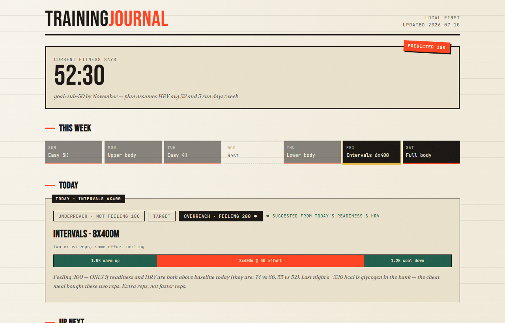
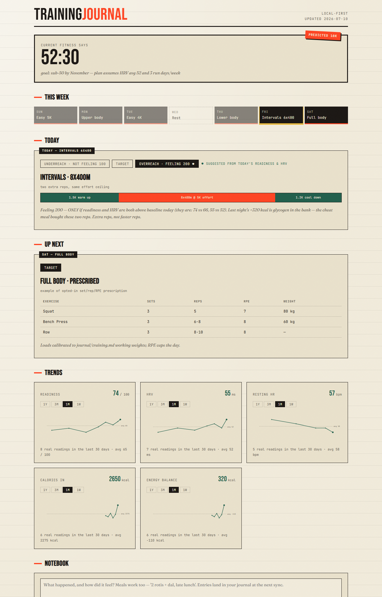

# TrainingJournal.me

**A training journal your AI actually reads — fully customisable, bound only
by what can be read from your devices.**

Fitness data today is scattered across apps whose plans are generic and
autogenerated: trackers collect data that planners never look at. With AI
assistants and MCP servers, all of your data can be pulled to *your own
machine*, where your stated goals and your actual history argue with each
other to produce plans that listen.

TrainingJournal.me is the harness for that. It is **local-first**: gathering,
storage, and planning happen on your machine. The only things that ever leave
it are a secret-free dashboard snapshot and (optionally) notebook entries
passing through a drained inbox.

## What it looks like

Today's session with the three-tier picker — overreach suggested because
readiness and HRV are both above baseline (all data shown is fictional
example content; `/initiate` makes it yours):



<details>
<summary>Full dashboard — week strip, prescribed strength, trends, notebook</summary>



</details>

## Quickstart

1. Click **Use this template** → create a **private** copy → clone it.
2. Open the clone in Claude Code (or any AI coding assistant — see
   [AGENTS.md](AGENTS.md)).
3. Run **`/initiate`**. It will:
   - ask which trackers and apps you use, and wire up the matching MCP
     servers ([docs/sources.md](docs/sources.md));
   - pull your real history into `journal/`;
   - interview you about your actual training — your current split for every
     workout type, your experience level, whether you want strength plans
     prescribed down to sets/reps/RPE/weights or kept list-only;
   - ask your goals;
   - optionally set up the dashboard deploy, password gate, and cloud inbox.
4. Train. **`/journal`** what happened, **`/plan`** when you need a plan,
   **`/sync`** daily (or install it as a scheduled routine).

## What lives where

| Path | What |
|---|---|
| `journal/` | Your data. Markdown, private, the single source of truth |
| `.claude/skills/` | The harness: initiate · journal · remember · pull-data · meal · plan · sync |
| `AGENTS.md` | The same flows as prose, for non-Claude assistants |
| `app/` | Static dashboard (Vercel-ready, zero credentials) |
| `scripts/` | Inbox drain used by `/sync` |
| `docs/` | Conventions, privacy model, source connectors, Supabase setup |

## Every session ships three tiers

Plans never prescribe a single take-it-or-leave-it workout. Each session has:

- **underreach** — "not feeling 100": trimmed volume, quality stripped
- **target** — the baseline-goal session
- **overreach** — "feeling 200": a genuine step up, gated on readiness AND
  recovery signals being above baseline that day

The suggested tier is computed at view time from that day's readiness, HRV
vs its average, and how you say you feel — never precomputed.

## Fuel is a training signal

Pre-save your repeat meals once (`journal/meals.md`) and logging becomes one
line — from your agent or from the browser notebook (kind: meal). The sync
computes calories in, expenditure (tracker + calibrated BMR, steps as a
cross-check), and energy balance — then uses it: a cheat meal today is
glycogen tomorrow (the harder session gets scheduled where the fuel is),
quality sessions during deficits get fueling notes, and the sync **actively
hunts the lag** between deficit days and below-baseline sessions, surfacing
recurring patterns as evidence-counted hypotheses — never fake causation.

## Privacy model, one paragraph

Identity and history exist only in your private clone. Vercel receives a
static, secret-free snapshot behind an optional password gate. Supabase — if
you enable it at all — holds an insert-only inbox that is drained to zero on
every sync. This template contains no personal data; the example content in
docs is fictional. Full detail: [docs/privacy.md](docs/privacy.md).

## Tests

```
npm test        # inbox-drain idempotency + password-gate hash vectors
npm run build   # static dashboard build
```

MIT licensed. Built from a real, running instance — every reconciliation
rule in these skills was learned from actual device data first.
